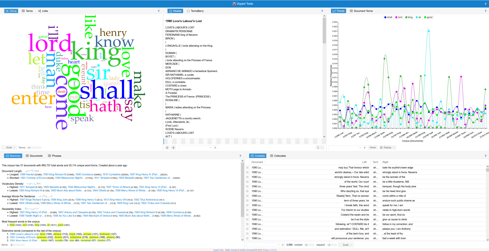
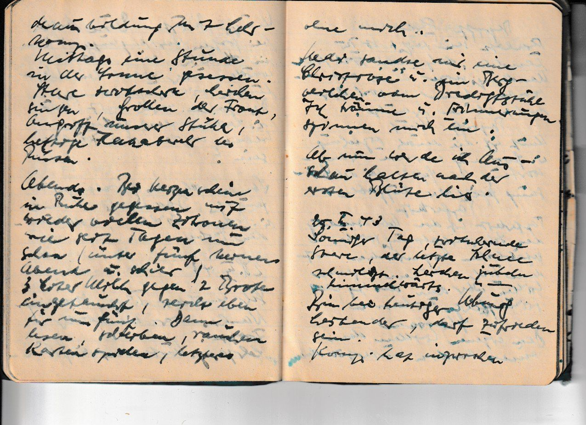
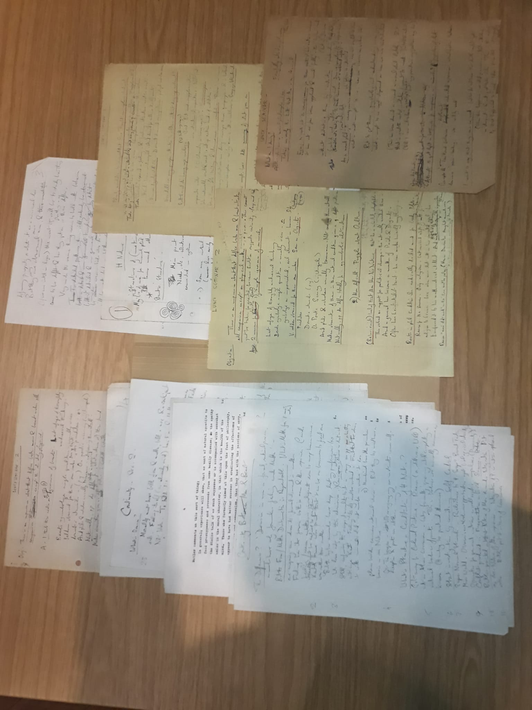
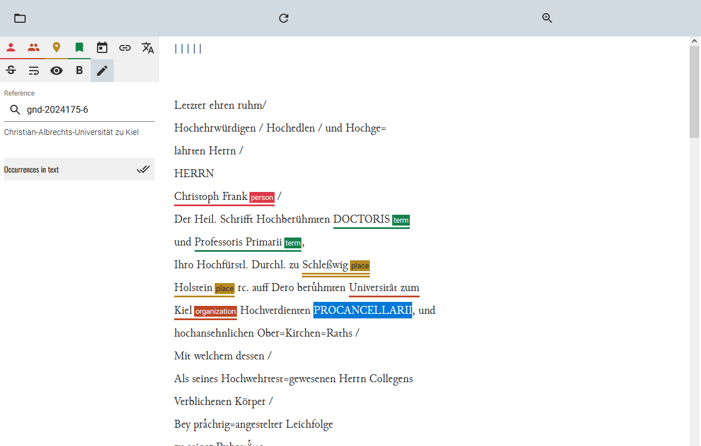
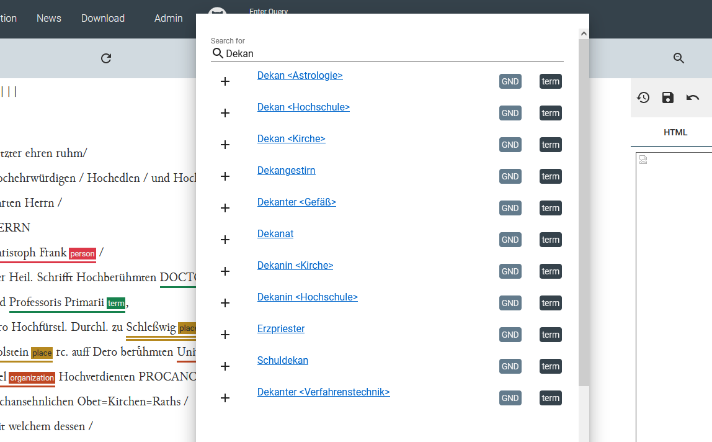

<!--

author: Moritz Riemann, Gregor Große-Bölting
email:  ggb@informatik.uni-kiel.de
version: 0.1
language: en
narrator: UK English Female

\-->

# Heinrich Blüchers Nachlass

**Dozierende:**

* Moritz Riemann (riemann@philsem.uni-kiel.de)
* Gregor Große-Bölting (ggb@informatik.uni-kiel.de)

**Zeit und Raum:** Di 16:15 - 17:45, CAP4 - R.13.1304a

**Inhalt:**

* Interdisziplinäres Arbeiten: Philosophie- und Informatikstudierende arbeiten zusammen und gewinnen Einblick in das andere Fach
* Einblick in die Digital Humanities und grundlegendes Verständnis digitaler Methoden geisteswissenschaftlicher Arbeit
* Arbeit mit X-Technologien, wie XML TEI, ODD, XSLT und RDF
* Praktische Fähigkeiten im Umgang mit Forschungsdaten und im kollaborativen Arbeiten
* Digitale Analyse- und Visualisierungsmethoden für geisteswissenschaftliche Fragestellungen
* Erforschung angemessener Formen interdisziplinär-digitaler Wissenschaft und Universität
* Reflexion der eigenen Fachkultur und der Methoden der Informatik bzw. Digital Humanities

**Literatur:**

* Blücher, H. (1952). Why and How We Study Philosophy. https://www.bard.edu/library/pdfs/bluecher/Why%20and%20How%20We%20Study%20Philosophy%20-%20Bl%C3%BCcher%20Archives%20PDF.pdf
* Kapitel 1 und 2 in: Jannidis, F., Kohle, H., & Rehbein, M. (2017). Digital Humanities. J.B. Metzler. https://doi.org/10.1007/978-3-476-05446-3

**Link zu OLAT:** https://lms.uni-kiel.de/auth/RepositoryEntry/5362057253/CourseNode/108032371510857

## Organisatorisches

### Regierungserklärung

1. Diese Veranstaltung ist ein Experiment: Wir setzen neue Methoden und Software ein. Seid also nachsichtig mit uns und mit euch selbst, wenn mal etwas nicht funktioniert wie geplant. Lasst uns zeitnah wissen, wenn ihr Probleme habt, dann findet sich für alles eine Lösung!
2. Ihr dürft (und sollt) gerne eigene Tools und Ideen einbringen! Der Seminarplan ist auch offen für Eure Vorschläge.
3. Interdisziplinarität lebt von wechselseitiger Verständlichkeit: Redet mit uns und mit Euren Mitstudierenden, wenn ihr Dinge nicht versteht oder Hilfe braucht.
4. Der Seminarplan ist "im Fluss".

### Semesterplan

| Datum | Thema/Inhalt |
|-------|--------------|
| 24.10. | Begrüßung, Einführung in das Thema, Überblick über das Semester |
| 31.10. | FEIERTAG |
| 07.11. | **Distant Reading** |
| 14.11. | Voyant: Tool-Präsentation und vers. Werkzeuge |
| 21.11. | Möglichkeiten und Einschränkungen |
| 28.11. | **Deep Reading** |
| 05.12. | TEI Publisher: Tool-Präsentation, TEI-Grundlagen |
| 12.12. | FÄLLT AUS |
| 19.12. | Ergebnisse; Unterschiede Deep Reading und Annotationen analog/digital |
| 09.01. | *Digitale* Forschungsfragen |
| 16.01. |  **Close Reading** |
| 23.01. | Tool-Präsentation |
| 30.01. | tba / Referate? |
| 06.02. | DOPPELSITZUNG (16 - 20 Uhr): Präsentation und Evaluation |

### Prüfungsleistung

**Für Informatiker_innen:** 

Details folgen.

* Werkstattbericht über einen der drei Teile (Distant/Deep/Close Reading), Details folgen (20%)
* Peer Review (20%)
* Poster und Posterpräsentation (30%)
* Ausarbeitung (30%)

**Für Philosoph_innen:**

Jede der Prüfungsformen beinhaltet die gemeinsame Präsentation in einer Kleingruppe am Ende des Semesters.

* Referate: bitte frühzeitig melden!
* Essay
* Hausarbeit
* mdl. Prüfung

---

Mögliche Referatsthemen:

* Einführung ins Denken Heinrich Blüchers
* Leuchtturmprojekte DH (Philosophie)
* Blücher, Arendt, Jaspers: Eine intellektuelle Freundschaft
* Chancen/Grenzen Deep Reading analog/digital
* ...


#### Hinweise zum Protokoll (für Informatiker_innen)

**Aufgabenstellung:** Schreibt ein Protokoll/Workshop-Bericht über eines der Tools, das für die drei Bereiche Distant, Deep und Close Reading vorgestellt wurden. Sucht euch dafür ein eigenes Textbeispiel, das mit Heinrich Blücher (oder Hannah Arendt) in Verbindung steht (von oder über ihn/sie) und reflektiert anschließend die Verwendung des Tools: Wie hat sich die Verwendung gestaltet? Was habt ihr herausgefunden bzw. welche Fragen sind offengeblieben? Was sind generell die Limitationen und Möglichkeiten des verwendeten Tools? 

Das Protokoll kann jederzeit **bis zum 09. Februar 2024** (Ende der Vorlesungszeit) per E-Mail (ggb@informatik.uni-kiel.de) bei mir als PDF eingereicht werden. 

Weitere Formalia:

* 500 Wörter (+/- 20%), etwa eine Seite
* Name, stu-Mailadresse
* Unterschriebene Eigenständigkeitserklärung
* Falls externe Quellen oder Literatur verwendet wurden, müssen diese gemäß eines üblichen Zitationsstandards (APA, IEEE, ACM, etc.) angegeben werden
* Falls ChatGPT o. ä. verwendet wurden: Umfang und Prompts angeben (ich rate von der Verwendung ab, da es sich um eine Reflexion der eigenen Erfahrungen mit dem Tool handeln soll)

Für eine ausreichende (oder bessere) Arbeit

* Besitzt der eingereichte Text eine klare Struktur
* Wurde eine Rechtschreib- und Grammatikprüfung durchgeführt
* Ein relevanter Text für die Analyse ausgewählt
* Werden Vor- und Nachteile des verwendeten Tools benannt

Eine gute (oder bessere) Arbeit

* Ist verständlich geschrieben und besitzt einen deutlichen, roten Faden
* Reflektiert euren fachlichen Hintergrund als Informatiker:in bei der Verwendung des Tools
* Bezieht die fachliche Expertise eines Mitstudierenden aus der Philosophie mit ein (bspw. bei der Auswahl des Textes, der Entwicklung einer Fragestellung, der Reflexion des eigenen Hintergrunds)
* Bezieht Erkenntnisse aus den Seminargesprächen mit ein


## Sitzung am 24.10.

### "Speed Dating"

Sprecht mit der Person, die euch gegenübersitzt, zwei Minuten über die folgenden Fragen:

1. Warum studiert Ihr Eure Disziplin?
2. Was bewundert Ihr an der jeweils anderen Disziplin?

Wenn das Signal gegeben wird, rücken diejenigen, die mit dem Gesicht zum Eingang/Front sitzen, einen Platz nach links.

Diejenigen die außen sitzen wechseln die Reihe und füllen den leeren Platz in der nächsten Reihe auf usw.

### Wer ist Heinrich Blücher?

Hannah Arendt über ihren Mann Heinrich Blücher in einem Brief an Karl Jaspers:

> Mein Mann heißt Heinrich Blücher -- schriftliche Beschreibung unmöglich. Er hat während des Krieges hier teils für die Armee, teils für Universitäten und teils als broadcaster gearbeitet auf Grund seiner militärwissenschaftlichen Kenntnisse. Mit Beendigung des Krieges ist er aus all diesen mehr oder minder offiziellen Dingen herausgegangen und arbeitet augenblicklich im economic research für Privatfirmen. Er stammt aus einer Berliner Arbeiterfamilie, hat in Berlin Geschichte unter Delbrück studiert, war dann Redakteur eines Nachrichtendienstes und hat sich verschiedentlich politisch betätigt. (Hannah Arendt an Karl Japsers, 29. Januar 1946, Arendt-Jaspers Briefe, S. 65)

<iframe width="100%" height="600px" frameborder="0" allowfullscreen allow="geolocation" src="https://umap.openstreetmap.fr/en/map/hannah-arendts-fluchtroute-von-berlin-nach-new-yor_977287?scaleControl=false&miniMap=false&scrollWheelZoom=false&zoomControl=true&editMode=disabled&moreControl=true&searchControl=null&tilelayersControl=null&embedControl=null&datalayersControl=true&onLoadPanel=undefined&captionBar=false&captionMenus=true"></iframe><p><a href="https://umap.openstreetmap.fr/en/map/hannah-arendts-fluchtroute-von-berlin-nach-new-yor_977287?scaleControl=false&miniMap=false&scrollWheelZoom=true&zoomControl=true&editMode=disabled&moreControl=true&searchControl=null&tilelayersControl=null&embedControl=null&datalayersControl=true&onLoadPanel=undefined&captionBar=false&captionMenus=true">See full screen</a></p>

### Why and How We Study Philosophy

> In philosophy we have no right to throw out one erroneous answer if that answer has quality (human experience), and since in philosophy we are concerned with the idea itself (for example: philosophy is concerned with the idea of God, religion with the existence of God) and how it was possible for man to arrive at that idea or answer at all, we have always to look and to inquire again. So in discussing the situation we now find ourselves in and how it came about and man's changed position in the world, we have to look back at how man lived up to 1800 and have to ask: How was it possible and how did it happen that man believed in God almost up to 1800 and then suddenly stopped--replacing this dropped belief with a merely negative belief that God did not exist. (Heinrich Blücher: Why and How We Study Philosophy)

### Zur nächsten Sitzung

* Erste Vorlesung (S. 1 - 5) in: Heinrich Blücher. Why and How We Study Philosophy. https://www.bard.edu/library/pdfs/bluecher/Why%20and%20How%20We%20Study%20Philosophy%20-%20Bl%C3%BCcher%20Archives%20PDF.pdf 
* Kapitel 1 und 2 in: Jannidis, F., Kohle, H., & Rehbein, M. (2017). Digital Humanities. J.B. Metzler. https://doi.org/10.1007/978-3-476-05446-3 (über die UB digital verfügbar!)
* Moretti, F. (2000). Conjectures on World Literature. New Left Review, 1, 54–68. https://newleftreview.org/issues/ii1/articles/franco-moretti-conjectures-on-world-literature

## Sitzung am 07.11.

Diese Sitzung ist der Methode des *Distant Reading* gewidmet. Dazu werden zunächst drei verschiedene Fallstudien betrachtet, die alle unterschiedliche Bereiche der Philosophie mit verschiedenen Zugängen "aus der Ferne" zu ergründen versuchen. Anschließend erfolgt eine Diskussion des Papers, in dem die Begriffsprägung *Distant Reading* durch den italienischen Literaturwissenschaftler Franco Moretti erfolgt ist.

Weiterführende Literatur und Ressourcen:

* Ted Underwood: A Genealogy of Distant Reading. In: digital humanities quarterly. Vol. 11, No. 2, 2017
* Kathryn Schulz: What is Distant Reading? In: New York Times, 24. Juni 2011 (https://www.nytimes.com/2011/06/26/books/review/the-mechanic-muse-what-is-distant-reading.html)
* Zwei Besprechungen von [Morettis Buch](https://www.wallstein-verlag.de/9783835390768-distant-reading.html), die zu sehr unterschiedlichen Schlüssen kommen: https://literaturkritik.de/id/22506 und https://literaturkritik.de/id/22507

### Fallstudie 1: Nietzsche

> The basic idea is extremely flat-footed and simple-minded: I come up with a list of concepts or constructs that, based on my reading of Nietzsche over the years as well as my familiarity with the secondary literature, are probably important for him. Then I associate each concept or construct with the German words (actually word stems) that he uses to refer to or express it. For instance, the concept of  virtue  is associated with anything beginning with ‘tugend’. Some concepts are associated with only one word stem, others with multiple. [...] Once I’m satisfied with the list of word stem(s) associated with a given concept, I then run an algorithm over the entire corpus to find out which passages contain which concepts. I initially did this all by hand via www.nietzschesource.org, which is an outstanding resource. It took months. But then I met a computer scientist by the name of Marc Cheong who figured out how to do it automatically in the course of about a minute. (https://www.3-16am.co.uk/articles/nietzsche-and-virtue?c=end-times-series)

In einem [ausführlichen Blog-Post](http://www.alfanophilosophy.com/blog/2017/7/25/a-semantic-network-approach-to-the-history-of-philosophy-or-what-does-nietzsche-talk-about-when-he-talks-about-emotion) erläutert Mark Alfano, wie er das Gesamtwerk von Friedrich Nietzsche anhand einiger vorausgewählter Konzepte codiert und die Ergebnisse als Netzwerk visualisiert hat. Zudem ist durch verschiedene Visualisierungen pro Werk die zeitliche Entwicklung von Konzepten im Schreiben Nietzsches nachvollziehbar.

Besonders interessant sind dabei insbesondere der Methodenteil zu Anfang und einige der Schlüsse, die Alfano aus seiner Analyse zieht (werden *ressentiment* und *Wille zur Macht* möglicherweise nur deswegen mit Nietzsche verbunden, weil sie im Text durchgehend kursiviert sind?).


### Fallstudie 2: Ancient Philosophers: A First Statistical Survey

> Until recently, ancient philosophy was studied by genuine philosophers concerned with the history of ideas, or by philologists trying to provide editions and translations of documents handed down by the manuscript tradition. Philosophy as a social movement in the ancient world, the daily professional activity of the well-established figure of the philosopher, or the impact of philosophical ideas on the Greek and Roman societies have not produced an extensive literature. While some intuitive convictions are commonly held on these matters, no general inquiry has ever been carried out, and no statistical value of any kind is currently available. Asking specialists how many philosophers are known through our documents would  probably produce very disparate answers. Standard books on the history of philosophy would suggest a few hundred, some more specialized  dictionaries or encyclopedias perhaps some six or seven hundred, but our own accounts have identified nearly 3000 names, not all of whom are  necessarily full-fledged philosophers, but at least important witnesses of ancient philosophical tradition

Das Projekt versucht anhand der Zeugnisse von über knapp 3.000 Philosoph:innen einen Überblick über die antike Philosophie zu geben. Dafür werden verschiedene Merkmale wie Geschlecht, Schulzugehörigkeit und politisches Engagement in Betracht gezogen.

Das zugehörige Paper gibt es hier: https://doi.org/10.1002/9781118609187.ch2 oder im Materialverzeichnis (OLAT).

### Fallstudie 3: Wittgenstein und Wittgensteinianer

> Our aim is that of focusing on works about Wittgenstein, rather than on Wittgenstein’s own philosophical work. There are two reasons why our work can be considered a case of distant reading. First, we take a certain ‘distance’ from Wittgenstein, our object of investigation. Second, we do not closely read the texts we investigate, but rather we attempt to reconstruct some of their aggregate properties. Methodologically, this article lies within the sociology of philosophy, based on the analysis of bibliographical data (McKenzie 1986, Santoro and Gallelli 2016, Gerli and Santoro 2018).

[Diese Studie](https://journals.openedition.org/jihi/317) untersucht nicht die Arbeiten des Philosophen Ludwig Wittgenstein, sondern analysiert die Bücher, Aufsätze und Autoren, die sich mit seinem Werk auseinandersetzen.

### Franco Moretti: "Conjectures on World Literature"

> Many people have read more and better than I have, of course, but still, we are talking of hundreds of languages and literatures here. Reading ‘more’ seems hardly to be the solution. Especially because we’ve just started rediscovering what Margaret Cohen calls the ‘great unread’. ‘I work on West European narrative, etc. ...’ Not really, I work on its canonical fraction, which is not even one per cent of published literature. And again, some people have read more, but the point is that there are thirty thousand nineteenth-century British novels out there, forty, fifty, sixty thousand—no one really knows, no one has read them, no one ever will. And then there are French novels, Chinese, Argentinian, American ...
>
> Reading ‘more’ is always a good thing, but not the solution.

https://newleftreview.org/issues/ii1/articles/franco-moretti-conjectures-on-world-literature

### Zur nächsten Sitzung

* Setzt euch mit einer der oben angegebenen Fallstudien auseinander ODER sucht selbst nach einem Anwendungsfall von *Distant Reading* in der Philosophie: Welche Vorarbeiten und Vorannahmen werden durch die Autor:innen geleistet/angenommen?
* Zweite Vorlesung (S. 6 - 11) in: Heinrich Blücher. Why and How We Study Philosophy. https://www.bard.edu/library/pdfs/bluecher/Why%20and%20How%20We%20Study%20Philosophy%20-%20Bl%C3%BCcher%20Archives%20PDF.pdf

## Sitzung am 14.11.

Diese Sitzung geht es darum zu verstehen, wie Verfahren zur automatischen Textverarbeitung funktionieren und welche Abstriche dabei in Kauf genommen werden. Außerdem beschäftigen wir uns mit Voyant Tools, einer Software zur automatischen Textanalyse.

Weiterführende Literatur und Ressourcen:

* In OLAT finden sich Vorlesungen von Heinrich Blücher zum Herumprobieren.
* Für alle, die sich dem Thema programmierend nähern möchten: https://pythonhumanities.com/python-for-dh-course/ 
* Weitere Texte für eigene Versuche finden sich bspw. im [Deutschen Textarchiv](https://www.deutschestextarchiv.de), z. B. Immanuel Kants ["Beantwortung der Frage: Was ist Aufklärung?"](https://www.deutschestextarchiv.de/book/show/16167)


### Grundlagen der automatischen Textverarbeitung

Texte werden im Computer als eine Zeichenkette oder eine Folge von Zeichen (*string*) repräsentiert. Dieser Ansatz ermöglicht es, Texte in digitaler Form zu speichern, zu verarbeiten und anzuzeigen. Jeder Buchstabe, Satzzeichen, Zahl oder Sonderzeichen, die in einem Text vorkommen, wird dabei durch eine spezielle Codierung abgebildet.

Eine der häufigsten Codierungen für die Repräsentation von Texten ist die ASCII-Codierung (American Standard Code for Information Interchange). Hierbei werden Buchstaben, Zahlen, Sonderzeichen und Steuerzeichen durch jeweils 7 oder 8 Bits dargestellt. Das bedeutet, dass jedem Zeichen eine eindeutige Binärsequenz zugeordnet wird, was es dem Computer ermöglicht, die Zeichen korrekt zu interpretieren und anzuzeigen.

")

**Beispiel:** Der String *Hallo* würde in ASCII als `01001000 01100001 01101100 01101100 01101111 00100001` repräsentiert werden. 

Mit der Zeit wurden weitere (und komplexere) Codierungsstandards entwickelt, um Zeichen aus verschiedenen Sprachen und Schriften darstellen zu können. Zum Beispiel ermöglicht Unicode die Darstellung einer Vielzahl von Schriftsystemen, darunter auch komplexere Schriften wie chinesische, arabische und indische Schriften. Unicode erweitert die ASCII-Codierung und weist jedem Zeichen eine eindeutige Nummer zu, wodurch es möglich wird, Texte in verschiedenen Sprachen und Schriftsystemen auf Computern korrekt wiederzugeben.

**Beispiel:** Angenommen, wir haben den Text "こんにちは" in der japanischen Sprache, was "Konnichiwa" auf Englisch bedeutet. Jedes Zeichen in diesem Text wird gemäß der Unicode-Codierung einer spezifischen Nummer zugeordnet, die dann in binärer Form im Computer gespeichert wird. Für das Beispiel "こんにちは" würden die einzelnen Zeichen gemäß Unicode wie folgt dargestellt werden:

* "こ" entspricht der Unicode-Nummer U+3053
* "ん" entspricht der Unicode-Nummer U+3093
* "に" entspricht der Unicode-Nummer U+306B
* "ち" entspricht der Unicode-Nummer U+3061
* "は" entspricht der Unicode-Nummer U+306F

Die Repräsentation von Texten als Zeichenketten im Computer bildet die Grundlage für Textverarbeitungsanwendungen, Suchmaschinen, Datenbanken und viele weitere digitale Anwendungen im Bereich der Geisteswissenschaften. Sie ermöglicht die Speicherung und Analyse von Texten in digitaler Form, was die Arbeit mit großen Textmengen und die Durchführung komplexer Textanalysen erleichtert.

#### Dokument und Korpus

Ein *Dokument* repräsentiert eine einzelne Einheit von Text, die als Ganzes betrachtet wird. Es kann sich dabei um einen Artikel, einen Blogbeitrag, eine E-Mail, einen Abschnitt eines Buches oder eine andere Texteinheit handeln. In der Textanalyse wird ein Dokument oft als die kleinste verarbeitbare Einheit betrachtet. Analysen, wie die Extraktion von Schlüsselwörtern, Sentimentanalyse oder Themenmodellierung, können auf der Ebene einzelner Dokumente durchgeführt werden.

Ein *Korpus* bezeichnet eine Sammlung von Textdokumenten. Es ist eine größere Menge von Texten, die für eine bestimmte Analyse oder Forschungszwecke zusammengestellt wurde. Korpora dienen als Grundlage für umfassendere Textanalysen. Sie ermöglichen die Extraktion von Mustern, Trends und Informationen auf der Ebene der gesamten Textsammlung. Korpora können aus Texten zu einem bestimmten Thema, aus einer bestimmten Quelle oder aus verschiedenen Genres bestehen und werden in verschiedenen Bereichen wie maschinelles Lernen, Sprachverarbeitung und Textlinguistik verwendet.

Die Grenzen zwischen *Dokument* und *Korpus* sind nicht zwingend fixiert: Wir können Blüchers Vorlesung "Why and How We Study Philosophy" als ein Dokument *oder* als einen Korpus (bestehend aus einer Reihe von Dokumenten, den Vorlesungen) betrachten. 

#### Stopwords

**Beispiel:** Wir betrachten den folgenden Textausschnitt von Heinrich Blücher: 

> In philosophy we have no right to throw out one erroneous answer if that answer has quality (human experience), and since in philosophy we are concerned with the idea itself (for example: philosophy is concerned with the idea of God, religion with the existence of God) and how it was possible for man to arrive at that idea or answer at all, we have always to look and to inquire again. So in discussing the situation we now find ourselves in and how it came about and man's changed position in the world, we have to look back at how man lived up to 1800 and have to ask: How was it possible and how did it happen that man believed in God almost up to 1800 and then suddenly stopped--replacing this dropped belief with a merely negative belief that God did not exist. (Heinrich Blücher: Why and How We Study Philosophy)

Durch die Entfernung von *stopwords* wird aus dem Ausgangs- der folgende Text:

> philosophy throw erroneous answer answer quality (human experience), philosophy concerned idea philosophy concerned idea God, religion existence God) man arrive idea answer inquire discussing situation man's changed position man lived 1800 happen man believed God 1800 suddenly stopped--replacing dropped belief negative belief God exist.

Die folgenden *stopwords* wurden in diesem Falle entfernt:

> in we have no right to out one if that has and since are with the itself for example is of how it was possible at or all always look again so now find ourselves came about world back up ask did almost then this a merely not

---

*Stopwords* sind häufig vorkommende Wörter in einer Sprache, die jedoch wenig semantische Bedeutung tragen. Beispiele für Stopwords im Englischen sind "and", "the", "is", usw. In der automatischen Textverarbeitung werden diese Wörter oft als Rauschen betrachtet, da sie wenig zur inhaltlichen Analyse beitragen, aber viel Speicherplatz und Rechenzeit in Anspruch nehmen können.

Die Funktion von *stopword removal* besteht darin, diese häufigen Wörter aus einem Text zu entfernen, um die Relevanz der verbleibenden Wörter zu erhöhen. Dieser Prozess kann durch Filtern einer vordefinierten Liste von Stopwords oder durch Analyse der Häufigkeit von Wörtern im Kontext eines spezifischen Textkorpus erfolgen. Durch das Entfernen von Stopwords können Textanalysen präziser werden, da die Betonung auf bedeutungsvolleren Wörtern liegt. Dies ist besonders nützlich in den digitalen Geisteswissenschaften, wo die inhaltliche Interpretation von Texten im Vordergrund steht und Rauschen in Form von häufigen, aber wenig aussagekräftigen Wörtern vermieden werden soll.

Fragen:

1. Wer legt fest, was ein *stopword* ist? Welche Konsequenzen hat das?
2. Was verbessert *stopword removal*? Was wird dadurch schlechter?

#### Stemming und lemmatization

**Beispiel:** Wir betrachten (erneut) den folgenden Textausschnitt von Heinrich Blücher: 

> In philosophy we have no right to throw out one erroneous answer if that answer has quality (human experience), and since in philosophy we are concerned with the idea itself (for example: philosophy is concerned with the idea of God, religion with the existence of God) and how it was possible for man to arrive at that idea or answer at all, we have always to look and to inquire again. So in discussing the situation we now find ourselves in and how it came about and man's changed position in the world, we have to look back at how man lived up to 1800 and have to ask: How was it possible and how did it happen that man believed in God almost up to 1800 and then suddenly stopped--replacing this dropped belief with a merely negative belief that God did not exist. (Heinrich Blücher: Why and How We Study Philosophy)

Durch *stemming* wird daraus:

> In philosophi we have no right to throw out one erron answer if that answer ha qualiti ( human experi ), and sinc in philosophi we are concern with the idea itself ( for exampl : philosophi is concern with the idea of God , religion with the exist of God ) and how it wa possibl for man to arriv at that idea or answer at all , we have alway to look and to inquir again . So in discuss the situat we now find ourselv in and how it came about and man ' s chang posit in the world , we have to look back at how man live up to 1800 and have to ask : How wa it possibl and how did it happen that man believ in God almost up to 1800 and then suddenli stop -- replac thi drop belief with a mere neg belief that God did not exist .

Durch *lemmatization*:

>  in philosophy we have no right to throw out one erroneous answer if that answer have quality ( human experience ) , and since in philosophy we be concern with the idea itself ( for example : philosophy be concern with the idea of God , religion with the existence of God ) and how it be possible for man to arrive at that idea or answer at all , we have always to look and to inquire again . so in discuss the situation we now find ourselves in and how it come about and man 's change position in the world , we have to look back at how man live up to 1800 and have to ask : how be it possible and how do it happen that man believe in God almost up to 1800 and then suddenly stop -- replace this drop belief with a merely negative belief that God do not exist .

--- 

*Stemming* und *Lemmatisierung* sind zwei Techniken der Textnormalisierung in der linguistischen Verarbeitung von Texten. Beide Methoden zielen darauf ab, Wörter auf ihre Grundformen zu reduzieren, um Textanalysen zu verbessern.

*Stemming* ist ein Verfahren, bei dem Wörter auf ihren sogenannten Stamm (oder Wortstamm) reduziert werden, indem übliche Suffixe entfernt werden. Dies bedeutet, dass verschiedene grammatische Formen eines Wortes auf denselben Stamm zurückgeführt werden, unabhängig von ihrer spezifischen Flexion. Das Wort "running" wird durch Stemming auf den Stamm "run" reduziert.

Im Gegensatz dazu versucht die *Lemmatisierung*, Wörter auf ihre lexikalische Grundform (Lemma) zurückzuführen. Dabei werden nicht nur grammatische Formen, sondern auch die semantische Bedeutung berücksichtigt. Das Ergebnis ist ein echtes Wort (Lemma), das im Wörterbuch zu finden ist. Das Wort "better" wird durch Lemmatisierung auf die Lemme "good" reduziert.

In beiden Fällen helfen *Stemming* und *Lemmatisierung* dabei, die Vielfalt der Formen eines Wortes zu reduzieren, was besonders in der Textanalyse und maschinellen Verarbeitung natürlicher Sprache (NLP) nützlich ist: Es erleichtert die Vergleichbarkeit von Wörtern und verbessert die Extraktion von Schlüsselinformationen aus Texten. Stemming ist dabei weniger aufwendig, während Lemmatisierung in der Regel präzisere Ergebnisse liefert.

#### Bag-of-words und n-Grame

**Beispiel:** Wir betrachten (schon wieder...) den folgenden Textausschnitt von Heinrich Blücher: 

> In philosophy we have no right to throw out one erroneous answer if that answer has quality (human experience), and since in philosophy we are concerned with the idea itself (for example: philosophy is concerned with the idea of God, religion with the existence of God) and how it was possible for man to arrive at that idea or answer at all, we have always to look and to inquire again. So in discussing the situation we now find ourselves in and how it came about and man's changed position in the world, we have to look back at how man lived up to 1800 and have to ask: How was it possible and how did it happen that man believed in God almost up to 1800 and then suddenly stopped--replacing this dropped belief with a merely negative belief that God did not exist. (Heinrich Blücher: Why and How We Study Philosophy)

Daraus wird als *bag-of-words*:

| to | and | in | we | have | how | the | be | it | that | ... |
|----|-----|----|----|------|-----|-----|----|----|------|-----|
| 8  |  8  | 6  | 5  | 5    | 5   | 5   | 4  | 4  | 4    | ... |

Als Darstellung mit *2-Gramm*en:

| we have | and how | with the | up to | how it | in philosophy | ... |
|---------|---------|----------|-------|--------|---------------|-----|
| 3       | 3       | 3        | 2     | 2      | 2             | ... |

---

*Bag-of-Words* ist eine Art der Textrepräsentation in der maschinellen Textverarbeitung. Bei dieser Methode wird ein Text als eine "Tasche" (englisch: bag) von Wörtern betrachtet, wobei die Reihenfolge der Wörter ignoriert wird, und nur die Häufigkeit der Wörter im Text berücksichtigt wird. Das bedeutet, dass die Information über die Wortreihenfolge im Text verloren geht, und der Fokus allein auf dem Auftreten der Wörter liegt. Diese Darstellung wird häufig für Textklassifikation, Clustering und andere Textanalysen verwendet.

Ein *n-Gramm* ist in der Sprachverarbeitung eine aufeinanderfolgende Sequenz von n Elementen (normalerweise Wörtern), die aus einem Text extrahiert werden. Diese Elemente können Buchstaben, Silben, Wörter oder sogar ganze Sätze sein, abhängig vom Kontext der Analyse. N steht dabei für die Anzahl der Elemente in einem n-Gramm.

#### Häufigkeit und Dichte

**Beispiel:** Wir betrachten (schon wieder...) den folgenden Textausschnitt von Heinrich Blücher: 

> In philosophy we have no right to throw out one erroneous answer if that answer has quality (human experience), and since in philosophy we are concerned with the idea itself (for example: philosophy is concerned with the idea of God, religion with the existence of God) and how it was possible for man to arrive at that idea or answer at all, we have always to look and to inquire again. So in discussing the situation we now find ourselves in and how it came about and man's changed position in the world, we have to look back at how man lived up to 1800 and have to ask: How was it possible and how did it happen that man believed in God almost up to 1800 and then suddenly stopped--replacing this dropped belief with a merely negative belief that God did not exist. (Heinrich Blücher: Why and How We Study Philosophy)

Das Wort *god* hat eine Worthäufigkeit `= 4`, die Dichte des Texts beträgt `0,545`. 

--- 

Die *Worthäufigkeit* (Term Frequency, TF) misst, wie oft ein bestimmtes Wort in einem Dokument erscheint, im Verhältnis zur Gesamtanzahl der Wörter in diesem Dokument. Ein höherer TF-Wert deutet darauf hin, dass das Wort im Dokument häufig vorkommt und kann als Indikator für die Relevanz des Worts im Kontext des spezifischen Dokuments dienen. Die TF-Metrik ist grundlegend für Bag-of-Words-Modelle und Textanalyseanwendungen.

Die *Wortschatzdichte* (Vocabulary Density) bezieht sich auf das Verhältnis der einzigartigen Wörter zur Gesamtanzahl der Wörter in einem Dokument. Ein Dokument mit einer höheren Wortschatzdichte enthält mehr unterschiedliche Wörter und zeigt somit eine größere sprachliche Vielfalt. Dies kann auf die inhaltliche Komplexität oder Spezifität eines Textes hinweisen und ist in der Textanalyse wichtig, um die Varianz des Wortschatzes in verschiedenen Dokumenten zu bewerten.


### Tool: Voyant




### Tool: Google Books N-Gram Viewer

Der [Google Books Ngram Viewer](https://books.google.com/ngrams/) ist ein leistungsstarkes Online-Tool, das es Nutzern ermöglicht, die Häufigkeit des Vorkommens bestimmter Wörter oder Phrasen in der Google-Büchersammlung über einen festgelegten Zeitraum zu analysieren. Im folgenden Beispiel sieht man bspw., wie häufig die Namen der Philosophen Martin Heidegger, Ludwig Wittgenstein und John Dewey zwischen 1900 und 2019 in deutschen Publikationen verwendet wurden:

<iframe name="ngram_chart" src="https://books.google.com/ngrams/interactive_chart?content=ludwig+wittgenstein,martin+heidegger,john+dewey&year_start=1950&year_end=2019&case_insensitive=on&corpus=de-2019&smoothing=3" width=1000 height=360 marginwidth=0 marginheight=0 hspace=0 vspace=0 frameborder=0 scrolling=no></iframe>

Das Tool kann für Geisteswissenschaftler sehr nützlich sein, weil es Einblicke in die Entwicklung und Verwendung bestimmter Begriffe oder Ideen im Laufe der Zeit bietet.

Hier ist ein kurzes Tutorial, das die Verwendung des [Google Books Ngram Viewer](https://books.google.com/ngrams/) anhand eines Beispiels erläutert:

**Schritt 1: Eingabe der Suchbegriffe** Überlegen Sie sich für Ihr philosophisches Beispiel geeignete Schlüsselbegriffe oder -phrasen. Nehmen wir an, Sie möchten die Entwicklung des philosophischen Begriffs "Existenzialismus" im 20. Jahrhundert analysieren. Geben Sie den Begriff "Existenzialismus" in das Suchfeld ein. Sie können auch verwandte Begriffe hinzufügen, um einen umfassenderen Kontext zu erhalten.

**Schritt 2: Festlegung der Parameter** Wählen Sie den gewünschten Zeitraum aus, den Sie analysieren möchten. Sie können den Zeitraum über die verfügbaren Optionen anpassen, z. B. von 1900 bis 2000. Achten Sie darauf, dass der gewählte Zeitraum für Ihre Analyse relevant ist.

**Schritt 3: Visualisierung und Analyse der Daten** Nachdem Sie die Suchbegriffe und den Zeitraum festgelegt haben, klicken Sie auf "Search". Der Ngram Viewer generiert dann ein Diagramm, das die Häufigkeit des Auftretens Ihrer Begriffe im ausgewählten Zeitraum anzeigt. Analysieren Sie die Grafik, um Trends, Spitzen oder Rückgänge in der Verwendung der Begriffe im Laufe der Zeit zu erkennen.

**Schritt 4: Interpretation der Ergebnisse** Basierend auf den angezeigten Daten interpretieren Sie die Ergebnisse und ziehen Sie Schlussfolgerungen über die Verbreitung und Relevanz des Begriffs "Existenzialismus" im Laufe des 20. Jahrhunderts. Beachten Sie dabei historische Ereignisse oder kulturelle Entwicklungen, die möglicherweise die Verwendung des Begriffs beeinflusst haben könnten.

**Schritt 5: Weiterführende Forschung** Verwenden Sie die gewonnenen Erkenntnisse als Ausgangspunkt für weitere Forschungen und Studien im Bereich der Philosophie. Vergleichen Sie beispielsweise die Verwendung von "Existenzialismus" mit anderen philosophischen Strömungen oder untersuchen Sie die Einflüsse bestimmter Philosophen auf die Verbreitung dieses Begriffs.

### Blücher: Distant Reading Ideen

**Bildet Kleingruppen!**

Entwickelt *Distant Reading* Ideen für die Vorlesung "Why and How We Study Philosophy" von Heinrich Blücher: Was interessiert euch? Wie könnten Voyant (oder der Google Books N-Gram Viewer) euch bei der Beantwortung der Fragen helfen?

### Zur nächsten Sitzung

Versucht Eure Idee für das *Distant Reading* von Heinrich Blücher als Kleingruppe umzusetzen. Entwickelt mindestens eine Visualisierung anhand der ihr Euer Forschungsinteresse/Eure Forschungsfrage beantworten könnt. 

## Sitzung am 21.11.

### Gruppenergebnisse

Die Kleingruppen präsentieren ihre Ergebnisse. 

### Kritik und Limitationen von DR

> Should our only ambition be to create authoritative totalizing patterns depending on untested statements by small groups of people treated as native informants? 
>
>(Spivak, Gayatri Chakravorty (2005). Death of a Discipline. Columbia University Press. pp. 107–8)

## Sitzung am 28.11.

**Wegen Streik ausgefallen!**


## Sitzung am 05.12.

Die Sitzung widmet sich den geisteswissenschaftlichen Grundlagen des Deep Reading.

### Beispiele für Text und Edition

#### Handschrift (Tagebuch, 1943)



  
#### Handschrift (Seminarnotizen von Mary Midgley, 1970er)



#### Edition von Homers Ilias mit textkritischem Apparat


## Sitzung am 12.12.


### XML-Grundlagen

> Wo sind euch bereits XML-Formate begegnet?
>
> Welche Beispiele könnt ihr nennen?
>
> Warum könnte das eine sinnvolle Möglichkeit sein Daten abzulegen?

#### Beispiele

Sowohl Word, als auch Excel (und andere Microsoft Office-Tools) speichern ihre Daten im XML-Format ab. Dafür steht das *x* in der Dateiendung *.docx* bzw. *.xlsx* (in dem Fall: das zweite *x*). Man *sieht* die XML-Daten nicht, weil sie komprimiert werden, im sogenannten Zip-Format. Mit ein wenig technischem Verständnis kann man aber die Rohdaten sichtbar machen. In der Regel ist das nicht erforderlich und sollte auch nicht gemacht werden: Word und Excel "wissen", wie sie mit diesen Informationen umgehen müssen, händische (menschliche) Interventionen können die Daten zerstören.

Ein weiteres Beispiel für XML (genau genommen: ein XML-ähnliches Format) ist die Hypertext Markup Language (HTML), die zum Bau von Websiten verwendet wird:


#### Grundlagen

XML — kurz für: eXtensible Markup Language — ist ein textbasiertes Format zur Speicherung von Daten. Von XML leiten sich verschiedene andere Standards ab, die jedoch alle gleichen Prinzipien folgen. Beispiele für solche abgeleiteten Standards sind TEI (*Text Encoding Initiative*), RDF (*Resource Description Framework*) oder XSLT (*Extensible Stylesheet Language Transformation*). XML ist eine Art Metasprache, um verschiedene Wege zu ermöglichen standardisierte Datenbeschreibungen vorzunehmen.

XML-Dokumente bestehen aus sogenannten *tags*:

```xml
<name>Max Mustermann</name>
```

Der *tag* ist in diesem Fall *name*, der aus einem öffnenden und schließenden (mit einem "/" beginnend) Anteil gebildet wird. Dadurch wird ausgezeichnet, *was* beschrieben wird, in diesem Fall ein Name. Der konkrete Name steht zwischen den Tags. Einzelne XML-Tags funktionieren also wie ein Oreo-Keks: Außen herum ist die langweilige, harte Beschreibung, innendrin der weiche, semantische Kern.


*Tags* können nun ineinander geschachtelt werden oder auch nebeneinander stehen. Stehen zwei *tags* nebeneinander spricht man von Geschwistern, ist ein Tag in einem anderen geschachtelt, so spricht man bei dem inneren von dem Kind- (oder *child*), bei dem äußeren von dem Vater- bzw. Eltern- (oder *parent* bzw. *ancestor*) *tag*.

Es **muss** immer ein Wurzelelement (*root element*) geben, dass alle anderen Elemente beinhaltet. Innerhalb dieses Wurzelelements kann es *siblings* geben, aber das *root element* kann niemals *sibling* zu einem anderen sein.

., CC BY-SA 3.0 <http://creativecommons.org/licenses/by-sa/3.0/>, via Wikimedia Commons")

In diesem Sinne funktioniert XML wie eine Matroshka-Puppe, da sich *tags* ineinander schachteln und dadurch hierarchische Strukturen bilden lassen:

```xml
<person>
   <name>Max Mustermann</name>
   <alter>30</alter>
      <adresse>
      <straße>Hauptstraße 1</straße>
      <stadt>Berlin</stadt>
      <land>Deutschland</land>
   </adresse>
</person>
```

Ist ein XML-Dokument in diesem Sinne korrekt formatiert, dann sagt man auch es sei **well-formed**: Es wurden keine syntaktischen Fehler gemacht, alle Klammern schließen korrekt und die öffnenden und schließenden *tags* sind korrekt gesetzt.

Es ist zudem möglich ein spezielles Schema mit einem Dokument zu verknüpfen um kenntlich zu machen, welche *tags* es gibt und in welcher Beziehung diese zueinander stehen können. Geschieht dies, so lässt sich automatisch überpüfen, ob ein Dokument **valide** (*valid*) ist.

Noch ein Hinweis zum Schluss: Wenn ein XML-Dokument selbst bestimmte Sonderzeichen innerhalb eines Tags verwenden möchte, so müssen diese Zeichen **escaped** werden:

```xml
<formula>3 < 4 => True</formula>
```

Würde unweigerlich zu einem Fehler führen, während

```xml
<formula>3 &lt; 4 =&gt; True</formula>
```

korrekt ist.

---

Als Vorlage dieses Abschnitts diente der hervorragende Blogbeitrag [A shamelessly short intro to XML for DH beginners (includes TEI)](https://latex-ninja.com/2022/02/02/a-shamelessly-short-intro-to-xml-for-dh-beginners-includes-tei/)

#### ChatGPT: Erklär mir XML als wäre ich ein 5-jähriger

Stell dir vor, dass du ein Bild malst und es deiner Freundin oder deinem Freund zeigen möchtest. Wenn du einfach nur das Bild zeigst, kann es schwierig sein, bestimmte Details oder Informationen zu erklären. Wenn du jedoch das Bild in kleinere Abschnitte aufteilst und jeder Abschnitt einen Namen gibst, kann es viel einfacher sein, bestimmte Elemente des Bildes zu identifizieren und darüber zu sprechen.

XML funktioniert auf eine ähnliche Weise. Es teilt Informationen in klar definierte Abschnitte auf, die als "Tags" bezeichnet werden, und jedem Tag wird ein Name gegeben, der beschreibt, was in diesem Abschnitt enthalten ist. Diese Tags können dann in einer bestimmten Reihenfolge angeordnet werden, um eine Struktur oder einen "Baum" von Informationen zu erstellen.

Zum Beispiel könnte XML verwendet werden, um Informationen über eine Person zu organisieren und auszutauschen:

```xml
<person>
   <name>Max Mustermann</name>
   <alter>30</alter>
   <adresse>
      <straße>Hauptstraße 1</straße>
      <stadt>Berlin</stadt>
      <land>Deutschland</land>
   </adresse>
</person>
```

In diesem Beispiel gibt es einen "person"-Tag, der die gesamten Informationen über eine Person enthält. Der "name"-Tag enthält den Namen der Person, der "alter"-Tag enthält das Alter, und der "adresse"-Tag enthält Informationen über die Adresse der Person, einschließlich der Straße, Stadt und Land. Jeder Tag ist klar definiert und in einer bestimmten Reihenfolge angeordnet, um die Informationen übersichtlich darzustellen.

Durch die Verwendung von XML können Computer leichter Informationen austauschen, weil sie wissen, wo sie bestimmte Informationen finden und wie sie auf diese zugreifen können, ohne dass menschliche Intervention erforderlich ist.

#### Übungen

**1.** Gegeben ist das folgende XML-Dokument:

```xml
<person>
   <name>Max Mustermann</name>
   <alter>30</alter>
   <adresse>
      <straße>Hauptstraße 1</straße>
      <stadt>Berlin</stadt>
      <land>Deutschland</land>
   </adresse>
</person>
```

a) Ist das Dokument **well-formed**?

[(X)] Ja
[( )] Nein

b) In welchem Verhältnis stehen die *tags* *name* und *alter* (X ist _ zu Y) zueinander?

[( )] root element
[( )] child
[( )] parent
[(X)] sibling
[( )] ancestor
[( )] successor

c) In welchem Verhältnis stehen die *tags* *person* und *adresse* (X ist _ zu Y) zueinander?

[( )] root element
[( )] child
[(X)] parent
[( )] sibling
[( )] ancestor
[( )] successor

d) In welchem Verhältnis stehen die *tags* *land* und *person* (X ist _ zu Y) zueinander?

[( )] root element
[( )] child
[( )] parent
[( )] sibling
[( )] ancestor
[(X)] successor

---

**2.** Das folgende XML-Dokument ist nicht **well-formed**:

```xml
<book>
   <title>Harry Potter and the Sorcerer's Stone</title>
   <author>J.K. Rowling</autor>
   <year>1997</year>
   <publisher>Scholastic</publisher>
</book>
<genre>Fantasy</genre>
```

Welche Fehler sind darin enthalten?

[[X]] Es gibt kein Wurzelelement
[[ ]] Der Title-tag wird nicht korrekt geschlossen
[[X]] Der Author-tag wird nicht korrekt geschlossen
[[ ]] Es gibt keinen Publisher namens "Scholastic"
[[ ]] Harry Potter gehört in die Kategorie "YA Fantasy"

---

**3.** Das folgende XML-Dokument ist nicht **well-formed**:

```xml
<book>
   <title>The Catcher in the Rye<title>
   <author>J.D. Salinger<author>
   <year>1951</year>
   <publisher>Little, Brown and Company</publisher
</book>
```

Welche Fehler sind darin enthalten?

(Auswahlmöglichkeiten wurden hier bewusst ausgespart.)

### Gemeinsame Sprache TEI


1. Die Text-Encoding-Initiative ist ein Konsortium, das einen *community standard* erstellt und pflegt.
2. Sie stellen v.a. die guidelines zur Verfügung, die ein kontrolliertes Vokabular der Auszeichnung ermöglichen. Aus den (vermutlich) unendlichen Möglichkeiten der XML-Auszeichnungen trifft die TEI eine Auswahl und legt damit ein Vokabular und eine Grammatik fest.

> TEI P5 Guidelines
> http://www.tei-c.org/release/doc/tei-p5-doc/en/html/index.html  
> Version 4.6.0. (letztes Update am 04. April 2023)


#### Grundstruktur

Jedes valide TEI-Dokument enthält die folgenden Elemente:

1. Das Wurzelelement `<TEI>`
2. Einen "Namensraum" (*Namespace*), der im Wurzelelement als Attribut (`xmlns` angegeben ist): `<TEI xmlns="http://www.tei-c.org/ns/1.0">`
3. Eine Zuweisung des verwendeten Schemas
4. `<teiHeader>` für Metadaten
5. `<text>` enthält den eigentlichen, zu annotierenden Text

#### Header – Zuhause für Metadaten

Der Header (`teiHeader`) ist eines der wenigen verpflichtenden Elemente in TEI. Er enthält verschiedene beschreibende und Meta-Information zum Text, Transkription, Edition und Bearbeitungshistorie. 

Diese beschreibenden und erklärenden Metadaten, die der digitalen Ressource vorangestellt sind, werden bspw. von Repositorien, Bibliotheken und Archiven verwendet. Sie ermöglichen die schnelle Auffindbarkeit und Einschätzung einer (digitalen) Quelle. 

Der Header enthält außerdem häufig (*best practice!*) die Dokumentation der Kodierungspraxis, d.h. Informationen dazu, warum welche Begriffe wie codiert wurden. 

Der Header setzt sich wiederum aus verschiedenen *tags* zusammen, die ihrerseits weitere Informationen beinhalten:

* `<fileDesc>`: bibliographische Beschreibung der Datei
* `<encodingDesc>`: Verhältnis zwischen elektronischem Text und seiner Quelle
* `<profileDesc>`: Beschreibung der nicht-bibliographischen Merkmale des Textes, insbes. Sprache, Entstehung(sbedingungen), Beteiligte, Aussehen des Mediums
* `<xenoData>`: alle nicht TEI-konformenen Metadaten
* `<revisionDesc>`: dokumentiert die Änderungen, die an der elektronischen Datei vorgenommen wurden (wer, wann, was)

#### Beispiel für einen TEI-Header

```xml
<?xml version="1.0" encoding="UTF-8"?>
<TEI xmlns="http://www.tei-c.org/ns/1.0">
   <teiHeader>
      <!-- Title of the Text -->
      <fileDesc>
         <titleStmt>
            <title>What is the title of the text?</title>
         </titleStmt>
         
         <!-- Author Information -->
         <publicationStmt>
            <p>Who is the author of the text?</p>
            <author>Author's Name</author>
         </publicationStmt>
         
         <!-- Information about the Source of the Text -->
         <sourceDesc>
            <p>What is the source of the text? (e.g., book, article, manuscript)</p>
            <bibl>Source Information</bibl>
         </sourceDesc>
      </fileDesc>
      
      <!-- Information about the Encoding Process -->
      <encodingDesc>
         <editorialDecl>
            <p>Describe any editorial decisions or encoding practices used in the text.</p>
            <p>Editorial decisions: </p>
            <p>Encoding practices: </p>
         </editorialDecl>
      </encodingDesc>
      
      <!-- Information about the Project and Funding -->
      <profileDesc>
         <creation>
            <p>When was the text created?</p>
         </creation>
         
         <!-- Project and Funding Information -->
         <langUsage>
            <language id="en">English</language>
         </langUsage>
      </profileDesc>
      
      <!-- Information about the Text's Context -->
      <revisionDesc>
         <change>
            <p>Describe any revisions made to the text or encoding.</p>
         </change>
      </revisionDesc>
   </teiHeader>
   
   <!-- The main content of the text goes here -->
   <text>
      <!-- Content of the text -->
   </text>
</TEI>
```

#### Must-have: `fileDesc`

`<fileDesc>` ist das einzige verpflichtende Elemente im header. Aus der `<fileDesc>` werden wichtige Informationen übernommen, die für Katalogeinträge relevant sind und die Zitation der elektronischen Datei ermöglichen. AutorIn, Titel, HerausgeberIn, Publikation, Distribution, Angaben zur analogen Quelle, Verantwortliche, Finanzierung des Projekts etc. werden dort festgehalten.

Eine gute `<fileDesc>` weist gute wissenschaftliche Praxis aus und validiert digitale Publikationen als nachvollziehbar und zitierbar.

Innerhalb der `<fileDesc>` stehen verpflichtend:

1. `<titleStmt>` Angaben zum Titel der Datei
2. `<publicationStmt>` Angaben zu den Publikationsdaten der Datei
3. `<sourceDesc>` Angaben zur Quelle/Vorlage der Datei

Wie für die meisten Dinge zu Beginn einer Publikation, ist es ratsam, diese Informationen erst am Ende des Prozesses einzutragen und zu Beginn lediglich Platzhalter zu schreiben.

#### Unser Annotationsvokabular

Die folgenden TEI *tags* werden wir für die Auszeichnung der Blücher-Vorlesungen verwenden. Diese *tags* werden im `<text> .... </text>` verwendet und umschließen jeweils die von Blücher verwendeten Wörter/Begriffe. Durch Attribute können zusätzliche Informationen angegeben werden. 

Verpflichtend:

* Person (`persName`)
* Organisation (`orgName`)
* Ort (`placeName`)
* Term, Begriff (`term`)
* Datum (`date`)

Optional: 

* Link (`ref`)
* Abkürzung (`abbr`)
* Sic! (`sic`)
* Regulierende Eingriffe (`reg`)
* Highlight (`hi`)

Beispiel:

```xml
<?xml version="1.0" encoding="UTF-8"?>
<TEI xmlns="http://www.tei-c.org/ns/1.0">
   <teiHeader>
      <!-- ausgelassen... -->
   </teiHeader>
   
   <text>
      ...

      Why must man work philosophically and live philosophically? That can only be 
      explained by the seeming rigidness of this proposition, which almost brings 
      in a <term>categorical imperative</term>. I condemn <persName>Nietzsche</persName> 
      and <persName>Hegel</persName> for bringing in the "you must" (instead of
      <persName>Kant's</persName> "you shall") because it means if you do not, you 
      will be a dope.

      ...
   </text>
</TEI>
```

### Normdaten und Normdatenbanken

*Normdaten* bieten ein kontrolliertes Vokabular zur Identifikation von Personen, Orten, Institutionen u.v.m. In *Normdatenbanken* werden *Normdaten* anhand eines eindeutigen, persistenten Identifiers zur Verfügung gestellt. Dieser wird auch als *Uniform Resource Identifier* (URI) bezeichnet.

Normdaten stellen zum Teil die **FAIR**ness (Findable, Accessible, Interoperable, Reusable) von (Forschungs-)Daten sicher.

#### Wichtige Normdatenbanken (Autoritäten)

* GND (gemeinsame Normdatei): Personen, Körperschaften, Orte
* LCCN (Library of Congress Control Number): amerikanische Variante der GND
* VIAF (Virtual International Authority File): Mapping versch. Normdaten
* Geonames: offenes Projekt für Ortsnamen
* TGN (Getty Thesaurus of Geographic Names): Ortsnamen
* u.v.a.

#### Beispiel zur Verwendung von Normdatenbanken

```xml
<?xml version="1.0" encoding="UTF-8"?>
<TEI xmlns="http://www.tei-c.org/ns/1.0">
   <teiHeader>
      <!-- ausgelassen... -->
   </teiHeader>
   
   <text>
      ...

      Why must man work philosophically and live philosophically? That can only be 
      explained by the seeming rigidness of this proposition, which almost brings 
      in a <term ref="xyz-977821232">categorical imperative</term>. I condemn 
      <persName ref="gnd-121258564">Nietzsche</persName>  and 
      <persName ref="gnd-1163295531">Hegel</persName> for bringing in the "you must"
      (instead of <persName ref="gnd-122286111">Kant's</persName> "you shall") 
      because it means if you do not, you will be a dope.

      ...
   </text>
</TEI>
```

#### (opt.) Verlinkung und eigene Normdaten

Innerhalb eines TEI-Dokuments können wir selbst Identifikationen vergeben und *interne Normdaten* zur Verfügung stellen.

Die Verknüpfung eines Auszeichnung mit internen oder externen Normdaten erfolgt über eine Verlinkung (*linking*).

> In welchen Fällen könnte es sinnvoll sein eigene Normdaten zur Verfügung zu stellen?

#### (opt.) Linking

*Linking* wird verwendet, um Verbindungen zwischen identifizierten benannten Entitäten (*named entities*, z.B. Personen, Orte, Ereignisse, ...) und einer ausführlicheren Erklärung bzw. einem Normdatum herzustellen.

Eine Verlinkung wird mittels einem Identifier hergestellt, der im `ref`-Attribut des verlinkenden Tags angegeben wird.

Handelt es sich um einen internen Link, also um einen Link, der auf etwas verlinkt, das im gleichen Dokument definiert wird, muss ein `#` vor dem Identifier stehen.

#### (opt.) Beispiel

Das folgende, ausführliche Beispiel aus der [TEI Dokumentation](https://tei-c.org/release/doc/tei-p5-doc/en/html/ref-standOff.html) veranschaulicht sehr gut das Vorgehen: In einem speziellen Bereich, dem `standOff`, werden eigene Normdaten definiert: Die Städte Atlanta und Birmingham. Beide verfügen über einen eindeutigen, einzigartigen Identifier (`LATL` und `LBHM`). Diese IDs können im weiteren Text verwendet werden, um eine interne Verlinkung (bspw. `#LATL`) zwischen einer `placeName`-Auszeichnung und der entsprechenden Stadt herzustellen: `<placeName ref="#LATL">Atlanta</placeName>`.

```xml
<TEI xmlns="http://www.tei-c.org/ns/1.0">
 <teiHeader>
<!-- ... -->
 </teiHeader>
 <standOff>
  <listPlace>
   <place xml:id="LATL">
    <placeName>Atlanta</placeName>
    <location>
     <region key="US-GA">Georgia</region>
     <country key="USA">United States of America</country>
     <geo>33.755 -84.39</geo>
    </location>
    <population when="1963"
     type="interpolatedCensus" quantity="489359"
     source="https://www.biggestuscities.com/city/atlanta-georgia"/>
   </place>
   <place xml:id="LBHM">
    <placeName>Birmingham</placeName>
    <location>
     <region key="US-AL">Alabama</region>
     <country key="USA">United States of America</country>
     <geo>33.653333 -86.808889</geo>
    </location>
    <population when="1963"
     type="interpolatedCensus" quantity="332891"
     source="https://www.biggestuscities.com/city/birmingham-alabama"/>
   </place>
  </listPlace>
 </standOff>
 <text>
  <body>
<!-- ... -->
   <p>Moreover, I am <choice>
     <sic>congnizant</sic>
     <corr>cognizant</corr>
    </choice> of the interrelatedness of all communities and
   <lb/>states. I cannot sit idly by in <placeName ref="#LATL">Atlanta</placeName> and not be concerned about what happens
   <lb/>in <placeName ref="#LBHM">Birmingham</placeName>. <seg xml:id="FQ17">Injustice anywhere is a threat to justice everywhere.</seg> We
   <lb/>are caught in an inescapable network of mutuality, tied in a single garment
   <lb/>of destiny. Whatever affects one directly affects all indirectly. Never
   <lb/>again can we afford to live with the narrow, provincial <soCalled rendition="#Rqms">outside agitator</soCalled>
    <lb/>idea. Anyone who lives inside the United States can never be considered
   <lb/>an outsider anywhere in this country.</p>
<!-- ... -->
  </body>
 </text>
</TEI>
```

Neben dem `standOff`-Bereich, der sich unmittelbar unter dem TEI-Wurzelelement befindet, gibt es auch noch zwei Alternativen:

`back` beinhaltet Anhänge und vertiefende Informationen zu einem Text oder Textabschnitt. Entsprechend wird dieser Bereich in der Regel im Anschluss an einen `text` angefügt.

`particDesc` und `settingDesc` sind Elemente des TEI Headers und dienen dazu Personen, Organisationen (im Fall von `particDesc`) und Orte (im Fall von `settingDesc`) zu definieren.

Die verschiedenen Auszeichnungen haben verschiedene Anwendungsbereiche, die sich in der Dokumentation nachlesen lassen. Im Zweifel ist `standOff` in der Regel keine schlechte Wahl und kann verwendet werden, solange sich keine unmittelbaren Gründe ergeben, die dagegen sprechen.

#### Weitere Informationen

Vertiefende Informationen finden Sie hier (keine Pflichtlektüre, aber empfohlen):

> Kapitel 16 "Aufbau von Datensammlungen" (S. 223 - 233) in:
>
> Jannidis, F.; Kohle, H. & Rehbein, M. (Eds.): *Digital Humanities*. J.B. Metzler, 2017.

### Erste Schritte mit dem TEI Publisher

{{1}}
Der TEI Publisher begrüßt Sie mit dem folgenden Start-Bildschirm:


{{2}}
Loggen Sie sich zunächst mit den Login-Daten ein (oben rechts), die Sie von mir per Mail erhalten haben.

{{3}}
Klicken Sie anschließend auf "Annotation Samples": Dadurch kommen Sie in eine neue Ansicht, in der Sie eigene Dokumente hochladen können, in dem Sie sie mit *drag and drop* aus einem Verzeichnis in den Upload-Bereich (rechts, unterhalb des Logins) verschieben.


Anschließend sind die Dokumente in der Liste (mitte) sichtbar und können angeglickt werden. Dadurch gelangen Sie in die Annotationsansicht.

{{4}}
In der Annotationsansicht können Sie ein oder mehrere Worte markieren, wie Sie es aus anderen Textverarbeitungsprogrammen gewohnt sind. Durch einen Klick auf eines der Icon auf der linken Seite, versehen Sie die Markierung mit einer TEI-Annotation (einem *tag*).



{{5}}
Es öffnet sich eine Suchmaske, die die Annotation mit einem eindeutigen *Identifier* in der GND verknüpft. Für die Suche müssen sie u. U. den Suchterm anpassen (und möglicherweise auch verschiedene ausprobieren).



{{6}}
Gibt es mehrere Auftreten des gleichen Terms im Dokument, dann erhalten Sie auf der linken Seite (unterhalb der Icon) die Möglichkeit durch das Anhaken der Boxen auch alle anderen Auftreten auszuzeichnen. Dies vereinfacht und beschleunigt die Annotation.

### Hausaufgabe

> 1. Bildet Kleingruppen (oder findet Euch in den "alten" Kleingruppen zusammen). Jede Kleingruppe sollte aus 2 bis 3 Personen bestehen und jeweils min. eine:n Philosoph:in und eine:n Informatiker:in umfassen.
> 2. Schreibt mir ein E-Mail (ggb@informatik.uni-kiel.de). Ich antworte Euch mit einem Nutzer-Account für Eure Gruppe und einem Teil der Blücher-Vorlesung als TEI Dokument. Das Dokument könnt ihr anschließend selbst im TEI Publisher hochladen.
> 3. Ihr annotiert bis zur nächsten Woche soweit ihr kommt. Organisiert Euch und Eure Arbeit dafür sinnvoll. Notiert Personen, Orte, Organisationen etc., die sich nicht annotieren lassen (weil es keine Normdaten gibt). 
> 4. Annotiert alle Personen, Organisationen, Orte, Begriffe und Daten in Eurem gesamten Dokument bis zum 09.01. 
> 5. Meldet Euch zeitnah per Mail oder Mattermost, falls Ihr Fragen habt!

## Sitzung am 19.12. 

In dieser Sitzung haben wir ein Referat zu Unterschieden zwischen Deep Reading analog und digital besprochen und damit das Thema "Deep Reading" vorläufig abgeschlossen. Außerdem wurden Fragen zur Arbeit mit dem TEI Publisher geklärt, Feedback zur Veranstaltung bisher eingeholt und das weitere Vorgehen angeteasert. 

### Zur nächsten Sitzung

Bzw. bis zum 12.01. sollen alle Kleingruppen ein Kapitel der Blücher-Vorlesung annotieren. 

Meldet euch bitte bei Gregor (ggb@informatik.uni-kiel.de), falls ihr entweder noch keine Kleingruppe und/oder kein Kapitel und keine Zugangsinformationen für den TEI Publisher habt.


## Sitzung am 09.01.

Diese Sitzung beschäftigt sich damit, wie man sinnvoll Forschungsfragen für Digital Humanities-Projekte entwirft und deren Umsetzung plant.

### Wiederholung: Why and How We Study Philosophy

### Inkshedding: Themenfindung

1. Faltet ein DIN A4-Blatt vertikal in der Mitte. Vervollständigt auf der linken Seite des Knicks den nachfolgenden Satz. Nutzt die komplette linke Seite und schreibt möglichst leserlich! Ihr habt 10 Minuten Zeit.

> Der Aspekt … interessiert mich besonders an den Vorlesungen von Heinrich Blücher, weil …

1. Anschließend werden alle Zettel eingesammelt, gemischt und erneut ausgeteilt. Lest den (hoffentlich fremden) Text und markiert und kommentiert die Punkte, die ihr besonders gut und spannend findet. Achtet auf interessante Inhalte und kommentiert immer positiv, etwa so: „Großartige Idee! Dazu fällt mir auch ein, dass …“. Dazu stehen 5 Minuten zur Verfügung.
2. Wir wiederholen 2. ein zweites Mal.

### Forschungsfragen

### Kleingruppen

## Sitzung am 16.01.

Diese Sitzung beschäftigt sich mit den geisteswissenschaftlichen Grundlagen von Close Reading

### Metzler Lexikon Literatur und Kulturtheorie: Begriffsbestimmung

> Close reading (engl., ›genaues, textnahes Lesen‹), eine Form der sehr detaillierten, gründlichen, textnahen und intensiven Lektüre und Interpretation, die völlig werkzentriert ist (Werkästhetik), von der Autonomie des Kunstwerks ausgeht, sämtliche Faktoren des Kontexts bewusst ausblendet und auf die Erschließung der sprachlichen Besonderheiten, formalen Merkmale und Bedeutungsnuancen des jeweiligen Werks konzentriert ist. Die theoretisch nur ansatzweise reflektierte Interpretationspraxis des c. r., die an am. und engl. Universitäten von den 1930er Jahren bis etwa 1970 vorherrschend war (und z.T. noch heute ist) und durch einflussreiche textbooks weite Verbreitung fand, ist kennzeichnend für Ansätze wie den am. New Criticism und die werkimmanente Interpretation. Den Prinzipien des c. r. sind darüber hinaus Theorie und Verfahren des Russ. Formalismus und der Dekonstruktion verpflichtet. Anders als der New Criticism und die Werkästhetik, die zwar die Ambiguität von Lit. betonen, aber »auf die Einheit des Textes oder einer Bedeutung zielen« (Weitz 1995, S. 360), steht in der Lektürepraxis der Dekonstruktion allerdings »das Identifizieren und Offenlegen von Differenzen durch andere Differenzen« (ebd.) im Vordergrund, wobei ›Differenz‹ (différance/différence; J. Derrida) als neuer Leitbegriff fungiert (vgl. Johnson 1980; Weitz 1995). Trotz der ungebrochenen Relevanz des c. r. (u. a. auch im New Historicism) haben die kulturgeschichtliche Lit.wissenschaft und andere kulturwissenschaftliche Ansätze (Kulturwissenschaft) zu einer Aufwertung des wide reading als komplementärer Methode geführt (vgl. Hallet 2010)

### Close Reading bei Spivak

Gayatri Chakravorty Spivak (\*1942)


  
Eine der einflussreichsten Vertreterinnen des New Criticism und der literatur- und kulturtheoretischen Linie der postcolonial studies. Unter anderem berühmt geworden durch Ihre Übersetzung von Derridas De la Grammatologie ins Englische.

Wichtigster Text: Can the subaltern speak? (1988); Kritik an Morettis Konzept des distant reading (s. Sitzung am 21.11.)

#### Auszug aus "Death of a Disciple"

> The world systems theorists upon whom Moretti relies are now producing sinocentric systems that are equally useless for literary study—that must depend on texture—because they equate economic with cultural systems. In fact, most close reading comparativists do not only read a few texts. They spread out and rely on good reference instruments such as Moretti will provide. They consult secondary texts based on other peoples’ close readings, as Moretti will. Where they can closely read, they see the “criticism” provided by the encyclopedist as necessarily superficial and unsatisfactory. (Death of a Disciple 2003, S. 108 N1)

#### Auszug aus "Close Reading"

> As a comparativist, I feel that one does not learn languages to bolster identity. The opposite, if anything - one ventures out to touch the other. Curiously enough, the Canadian First Nations, Inuit, and Metis say that their elders offer this lesson - the first lesson of responsibility. Paradoxically, even as the United Nations committee labors mightily to preserve the people's ability to say so, the institution must make it possible for other people to learn their languages, and not only for ethnographic purposes. The purposes, if you like, of close reading. What is it to read closely the riches of orature? I will repeat here the commonsense de scription of learning the first language that I often use: it will repeat what we know. Language is there because we want to touch another. The infant invents a language. The parents learn it. By way of this transaction, the infant enters a linguistic system that has a his tory before its birth and will continue to have a history after its death. Yet the adult this infant becomes will think of this language as his or her most intimate possession, and will mark it in a way, however small, that will be incorporated into his or her impersonal history. Only the first language is learned this way. It activates a mechanism once in a lifetime. \[...\] A knowledge-management model will never allow us to rethink the teaching and learning of languages in this way. Amit Bha duri makes the cogent remark that in the liberalized state, if the model is the market and the ordering principle is management, there will never be a "demand" for drinking water for the poor. The business of providing for the poor is then in the hands of the benevolent sovereign as structure, the economic textuality of which has been abundantly dismantled by heads better than mine. (Close Reading 2006, S. 1612)

### Übung: Close Reading

Lest jeder für sich Vorlesung 10, S. 67f., ab zweiter Absatz ("But the real principle...") bis S. 68 ("... and finally finding the authority in himself.").

Diskutiert in Kleingruppen (zwei bis drei Personen) den wesentlichen Gedankengang Blüchers. Bleibt dabei im Text und verwendet die Methode des Close Readings. Notiert eure Ergebnisse so, dass ihr sie in drei Minuten den anderen Teilnehmer:innen vorstellen könnt. Benennt dafür ein:e Sprecher:in.

## Sitzung am 22.01.

In dieser Woche bekommen wir Besuch von Britta Petersen vom Rechenzentrum, die uns einen Einblick in die FAIR-Prinzipien und weitere wichtige Überlegungen für das Forschungsdatenmanagement gibt. Außerdem sprechen wir über Werkzeuge für Netzwerkanalyse.
